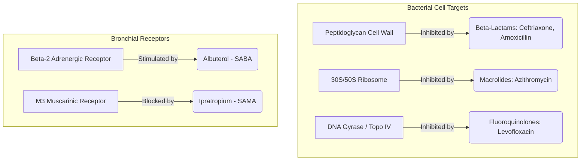

# Pulmonary Agents: Pathogens & Pharmacology Clinical Guide

This reference guide is designed for biology, nursing, and medical students. It provides high-yield details on key infectious pathogens ("agents") of the lungs and the pharmacological therapies used to target them.

---

## Part 1: Pulmonary Pathogens (Infectious Agents)

Pulmonary infections are classified by their anatomical and radiological distribution, clinical settings, and typical patient risk factors.

### 1. Streptococcus pneumoniae (Pneumococcus)
*   **Microbiology:** Gram-positive, lancet-shaped diplococci. $\alpha$-hemolytic, catalase-negative, optochin-sensitive, and bile-soluble.
*   **Virulence Factors:** Polysaccharide capsule (prevents phagocytosis), IgA protease (cleaves secretory IgA to facilitate mucosal attachment), Pneumolysin (cytotoxin that damages ciliated epithelial cells).
*   **Clinical Presentation:** Community-Acquired Pneumonia (CAP) presenting with sudden-onset high fever, shaking chills, productive cough with **rust-colored sputum**, and pleuritic chest pain.
*   **Physical Exam (Auscultation):** Coarse crackles (rales), dullness to percussion, increased tactile fremitus, and bronchial breath sounds over the affected area.
*   **Radiology:** Lobar pneumonia (dense consolidation typically localized to a single lobe).

### 2. Mycoplasma pneumoniae (Atypical / "Walking" Pneumonia)
*   **Microbiology:** Lacks a peptidoglycan cell wall (hence Gram-invisible and naturally resistant to cell-wall inhibitors like penicillins). Membrane contains sterols.
*   **Virulence Factors:** CARDS (Community-Acquired Respiratory Distress Syndrome) toxin, P1 adhesin (mediates attachment to respiratory epithelium, paralyzing cilia).
*   **Clinical Presentation:** Insidious onset of dry, non-productive hacking cough, low-grade fever, headache, sore throat, and malaise. Classically seen in school-aged children, military recruits, and college students living in close quarters. Can cause **cold agglutinins** (IgM antibodies that bind RBCs at low temperatures, leading to autoimmune hemolytic anemia) and erythema multiforme.
*   **Physical Exam:** Chest auscultation often sounds surprisingly normal, or reveals minimal scattered wheezes/rhonchi, despite prominent symptoms (hence "atypical").
*   **Radiology:** Diffuse, patchy, or interstitial infiltrates (often described as looking much worse than the patient feels).

### 3. Klebsiella pneumoniae
*   **Microbiology:** Gram-negative bacillus. Plump, encapsulated, lactose-fermenting, and urease-positive.
*   **Virulence Factors:** Extremely thick polysaccharide capsule (gives colonies a mucoid appearance on culture plates).
*   **Clinical Presentation:** Severe pneumonia characteristically in **chronic alcoholics, diabetics, and individuals prone to aspiration**. Produces a thick, gelatinous **currant-jelly sputum** (due to necrosis and hemorrhage of lung tissue). Often leads to early lung cavitation, abscess formation, and empyema.
*   **Physical Exam:** Decreased or absent breath sounds over areas of necrosis, pleural friction rub, and severe respiratory distress.
*   **Radiology:** Lobar consolidation, frequently with a **bulging fissure sign** (due to heavy mucoid inflammatory exudate) and early cavitation.

### 4. Legionella pneumophila
*   **Microbiology:** Gram-negative rod, but stains poorly. Visualized with silver stain. Cultured on **buffered charcoal yeast extract (BCYE)** agar supplemented with iron and L-cysteine.
*   **Transmission:** Aerosols from contaminated environmental water sources (e.g., air conditioning towers, hospital mist machines, cruise ship showers). No person-to-person transmission.
*   **Clinical Presentation:** "Legionnaires' disease." Severe pneumonia accompanied by **gastrointestinal symptoms** (watery diarrhea, abdominal pain), high fever, neurological symptoms (confusion, headache), and classic **hyponatremia** (low serum sodium due to SIADH or renal tubular dysfunction).
*   **Physical Exam:** Diffuse rales/crackles and signs of consolidation.
*   **Radiology:** Patchy, unilateral consolidations that can progress to multi-lobar consolidation.

### 5. Mycobacterium tuberculosis (TB)
*   **Microbiology:** Acid-fast bacillus (contains high concentrations of mycolic acid in the cell wall). Stains red with Ziehl-Neelsen or Kinyoun stains. Obligate aerobe.
*   **Pathogenesis:** Survives inside alveolar macrophages by preventing phagosome-lysosome fusion. Triggers a Type IV hypersensitivity reaction, leading to the formation of **caseating granulomas** (central necrosis surrounded by epithelioid macrophages, multinucleated Langhans giant cells, and lymphocytes).
*   **Clinical Presentation:** Chronic cough (often productive of blood-tinged sputum/hemoptysis), drenching night sweats, low-grade afternoon fevers, unexplained weight loss, and fatigue.
*   **Radiology:**
    *   *Primary TB:* Lower/middle lobe infiltrates and hilar lymphadenopathy (**Ghon complex**; if calcified, **Ranke complex**).
    *   *Secondary (Reactivation) TB:* Upper lobe cavitary lesions (due to high oxygen tension favoring growth of the obligate aerobe).

### 6. Pneumocystis jirovecii (PJP)
*   **Microbiology:** Atypical unicellular fungus. Does not respond to traditional antifungals (targeted with trimethoprim-sulfamethoxazole). Stained with Methenamine Silver stain showing crushed ping-pong ball-shaped cysts.
*   **Clinical Setting:** Opportunistic infection in immunocompromised hosts, classically in HIV patients with a **CD4 count < 200 cells/$\mu$L**.
*   **Clinical Presentation:** Subacute onset of progressive dyspnea on exertion, dry cough, hypoxemia out of proportion to exam findings, and fever.
*   **Physical Exam:** Bilateral dry crackles or often clear lungs on auscultation.
*   **Radiology:** Bilateral, diffuse, symmetrical **ground-glass opacities** radiating from the hilum (bat-wing pattern).

---

## Part 2: Respiratory Pharmacology

Antibacterial and respiratory drugs are classified by their cellular targets and mechanisms of action.

### 1. Beta-Lactam Antibiotics (e.g., Amoxicillin, Ceftriaxone)
*   **Mechanism of Action:** D-Ala-D-Ala structural analogs. Bind to and inhibit **Penicillin-Binding Proteins (PBPs)** (transpeptidases), preventing cross-linking of the peptidoglycan cell wall. This leads to osmotic lysis of growing bacteria.
*   **Clinical Use:** Ceftriaxone is a 3rd-generation cephalosporin used as first-line empiric treatment for Community-Acquired Pneumonia (covers *S. pneumoniae*, *H. influenzae*). Often combined with a macrolide to cover atypical pathogens.
*   **Key Resistance:** Production of $\beta$-lactamases or altered PBPs (as seen in MRSA).

### 2. Macrolides (e.g., Azithromycin, Erythromycin)
*   **Mechanism of Action:** Bind reversibly to the **50S ribosomal subunit** (specifically 23S rRNA), inhibiting peptidyltransferase activity and blocking ribosome translocation. This halts protein synthesis (bacteriostatic).
*   **Clinical Use:** Highly effective against atypical pulmonary pathogens (*Mycoplasma*, *Chlamydia*, *Legionella*) because these drugs accumulate intracellularly.
*   **Side Effects:** Prolonged QT interval, gastrointestinal motility stimulation, acute cholestatic hepatitis.

### 3. Fluoroquinolones (e.g., Levofloxacin, Moxifloxacin)
*   **Mechanism of Action:** Inhibit **bacterial DNA gyrase (Topoisomerase II)** in Gram-negative bacteria and **Topoisomerase IV** in Gram-positive bacteria. This prevents DNA replication by blocking the ligation reaction, introducing double-strand DNA breaks.
*   **Clinical Use:** Often called "respiratory quinolones" due to excellent lung tissue penetration and broad-spectrum coverage (covers both typical and atypical pathogens). Used in severe CAP or drug-resistant cases.
*   **Side Effects:** Tendonitis and tendon rupture (especially Achilles), cartilage damage in pediatric patients, QT prolongation, and aortic aneurysm dissection.

### 4. Anti-Tuberculosis Regimen (RIPE Therapy)
Active tuberculosis requires multi-drug regimens to prevent the rapid development of resistance.
1.  **Rifampin:** Inhibits bacterial **DNA-dependent RNA polymerase**, blocking transcription. Side effects: Orange/red body fluids (urine, tears, sweat), potent CYP450 inducer.
2.  **Isoniazid (INH):** Inhibits synthesis of **mycolic acids** (essential component of mycobacterial cell wall). Must be activated by mycobacterial catalase-peroxidase (*KatG*). Side effects: Hepatotoxicity, peripheral neuropathy (prevented by co-administering **Vitamin B6 / Pyridoxine**), drug-induced lupus.
3.  **Pyrazinamide:** Acidifies intracellular environment of phagolysosomes where TB resides. Side effects: Hyperuricemia (can trigger acute gouty arthritis), hepatotoxicity.
4.  **Ethambutol:** Inhibits **arabinosyltransferase**, blocking arabinogalactan polymerization in the cell wall. Side effects: **Optic neuritis** (red-green color blindness, decreased visual acuity; "Ethambutol for Eyes").

### 5. Respiratory Bronchodilators & Anti-inflammatories
Used in obstructive airway diseases (asthma, COPD) which can complicate or mimic pneumonia.
*   **Albuterol (Beta-2 Agonist):** Binds to $\beta_2$-adrenergic receptors on airway smooth muscle. Activates Gs-protein, increasing adenylate cyclase activity and raising intracellular cAMP. This activates Protein Kinase A (PKA), leading to smooth muscle relaxation and bronchodilation.
*   **Ipratropium (Anticholinergic):** Competitively blocks **M3 muscarinic acetylcholine receptors** on bronchial smooth muscles. Prevents acetylcholine-mediated bronchoconstriction and reduces mucus secretion.
*   **Fluticasone (Inhaled Corticosteroid):** Diffuses across cell membranes to bind glucocorticoid receptors. Inhibits transcription factors like NF-$\kappa$B, suppressing production of inflammatory cytokines (IL-1, IL-6, TNF-$\alpha$) and decreasing airway hyperresponsiveness and mucosal edema.
